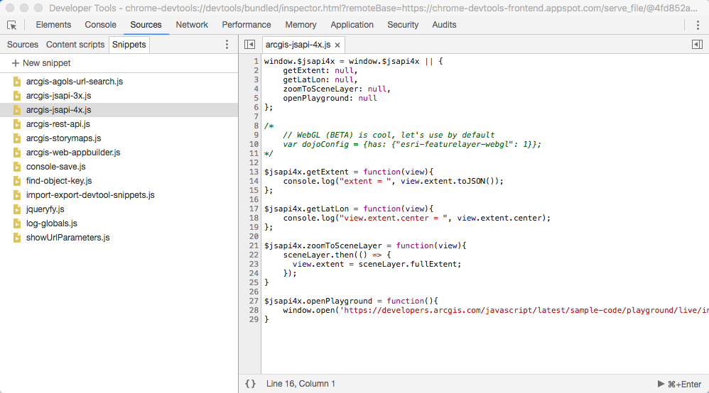
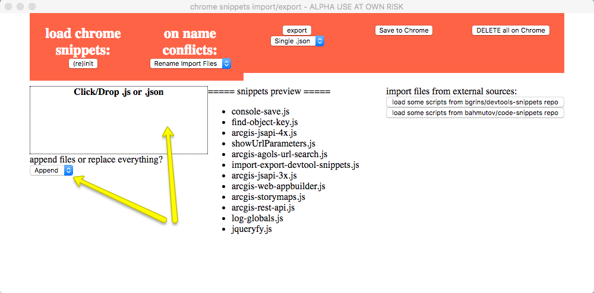

# Import Chrome DevTools Snippets

You can import some useful snippets to speedup your developments when making new [storymaps](https://esri-es.github.io/awesome-arcgis/arcgis/products/configurable-apps/), or building apps using [Web AppBuilder](https://esri-es.github.io/awesome-arcgis/arcgis/products/web-appbuilder/developer-edition/), the [ArcGIS API for JavaScript](https://esri-es.github.io/awesome-arcgis/front-end/technologies/dojo/):

**How to:**

* Open Inspector (ctrl+shift+I)
* Undock Inspector in Separate Window
* Inspect Inspector (ctrl+shift+i)
* Paste the next Script Into Console:

Then this window will show up:

And lastly download and drop [this JSON](./_snippets_2017_12_19.json)

## Contributions

We would like to receive your contributions. Open an issue or send a Pull Request.

---

Credits: [soundyogi](https://gist.github.com/soundyogi/03df95505604c8351212)
